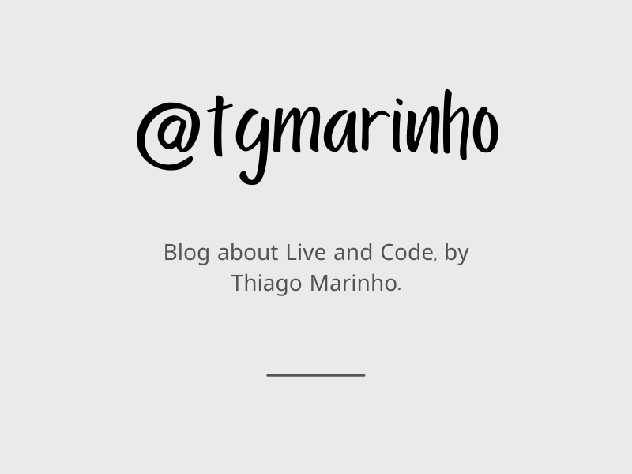

Hello! This repository contains the source code for [@tgmarinho](https://tgmarinho.com/), my personal blog about life and code. 🎉
It was inspired and forked from [Not a Number](https://nan.fyi/).
## Getting Started

This blog is built with [Next.js](https://nextjs.org/), [MDX](https://mdxjs.com/) and [Tailwind](https://tailwindcss.com/), supercharged with [styled-components](https://styled-components.com/) and [twin.macro](https://github.com/ben-rogerson/twin.macro). The backend for collecting feedback is built with Next.js and [Fauna](https://fauna.com/).

To get started:

1. Clone the repository:

```bash
git clone https://github.com/tgmarinho/tgmarinho-newblog.git
```

2. Cd into the directory and install dependencies:

```bash
cd tgmarinho-newblog
yarn install
```

3. Run the development server:

```bash
yarn dev
```

Open [http://localhost:3000](http://localhost:3000) with your browser to see the result. Note that at this point, the feedback form will NOT work.

To get the feedback form working using Fauna:

1. Get the API key from [Fauna](https://fauna.com/) by creating an account and provisioning a database
2. Add the API key to a `.env.local` file in the root directory:

```
FAUNA_SECRET_KEY=<my api key>
```

Alternatively, you can change where the feedback form submits by modifying the `submitFeedback` function in [FeedbackForm.js](https://github.com/tgmarinho/tgmarinho-newblog/blob/23cdaa5e0b5f75bbdabb8a53690061f2a6f84595/components/FeedbackForm.js#L98).
# tgmarinho-newblog
